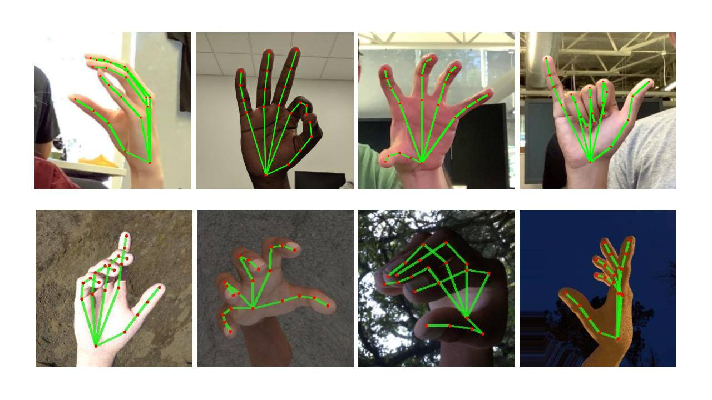

<div align="center">
  <h1>Gesture Volume Control Using OpenCV and Mediapipe</h1>
</div>

> This Project use OpenCV and Mediapipe to Control volume 

## REQUIREMENTS
+ opencv-python
+ mediapipe
+ comtypes
+ numpy
+ pycaw

```bash
pip install -r requirements.txt
```
### MEDIAPIPE
<div align="center">
  
</div>

> MediaPipe offers open source cross-platform, customizable ML solutions for live and streaming media.

#### Hand Landmark Model

After the palm detection over the whole image our subsequent hand landmark model performs precise keypoint localization of 21 3D hand-knuckle coordinates inside the detected hand regions via regression, that is direct coordinate prediction. The model learns a consistent internal hand pose representation and is robust even to partially visible hands and self-occlusions.

To obtain ground truth data, we have manually annotated ~30K real-world images with 21 3D coordinates, as shown below (we take Z-value from image depth map, if it exists per corresponding coordinate). To better cover the possible hand poses and provide additional supervision on the nature of hand geometry, we also render a high-quality synthetic hand model over various backgrounds and map it to the corresponding 3D coordinates.
<div align="center">
    
    
    
</div>


## 📝 CODE EXPLINATION
<b>Importing Libraries</b>
```py
import cv2
import mediapipe as mp
import math
import numpy as np
from ctypes import cast, POINTER
from comtypes import CLSCTX_ALL
from pycaw.pycaw import AudioUtilities, IAudioEndpointVolume
```
***


<div align = "center">
<h2>📬 Contact</h2>

If you want to contact me, you can reach me through below handles.

<a href="https://twitter.com/prrthamm">@prrthamm</img></a>&nbsp;&nbsp; <a href="https://www.linkedin.com/in/pratham-bhatnagar/"> Pratham Bhatnagar</img></a>

</div>